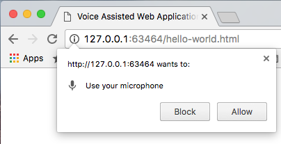
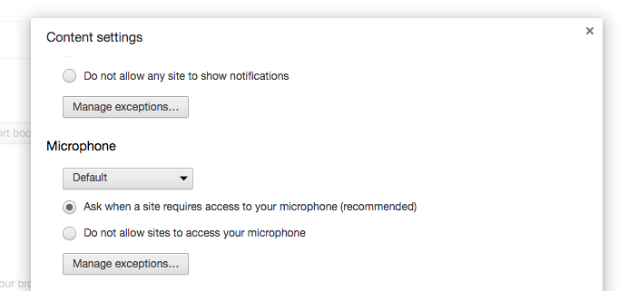
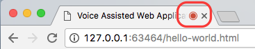

# Voice Assistant

Easily build Voice Assisted Web Applications using ``VoiceAssistant.js``. Include ``VoiceAssistant.js`` like any other javascript into your web page and make your applications voice enabled. Voice driven applications are becoming increasingly popular, so as the technologies and standards on those technologies.

This work is an experimental work based on draft specification defined in [Web Speech API](https://dvcs.w3.org/hg/speech-api/raw-file/tip/speechapi.html) by [W3C](https://www.w3.org/) and Chrome browser support on those specification.

``VoiceAssistant`` combines ``SpeechRecognition`` and ``SpeechSynthesis`` to simplify common Web Application specific usage and act as a controller. ``VoiceAssistant.js`` will work only in Chrome browser v33 and above as [Web Speech APIs](https://dvcs.w3.org/hg/speech-api/raw-file/tip/speechapi.html) ``SpeechRecognition`` and ``SpeechSynthesis`` are currently supported only in Chrome browsers v33 and above.

## Getting Started
### How add Voice Assistance to your Web Page ?
Add the ``voiceAssistant.js`` to your web page like any other javascript file and configure ``VoiceAssistant`` specific to current application by invoking  ``voiceAssistant.configure({}/*map of config*/)`` :

```
<script type="text/javascript" src="includes/js/VoiceAssistant.js"></script>
<script type="text/javascript">
   window.onload = function (){
     voiceAssistant.configure(
       {
         listenContinuously: true,
         requestHandlers: [
             new VoiceRequestHandler([
                 "Hello",
                 "Hey",
                 "How are you"
             ], function() {
                 voiceAssistant.say("Hello! Happy to hear from you! how are you?");
             })
         ],
         callBackAfterReady: function() {
             voiceAssistant.say("Hello! Welcome to Vimal's Voice Assistant !");
         }
       }
     );
   };
</script>
```

This will enable Speech Recognition and Speech Synthesis for you page. On successful load of the page in the browser it should greet you with voice message *'Hello! Welcome to Vimal's Voice Assistant !'*. Also for the first time, it will ask you for permission to *Use you microphone* for the domain from which the page is loaded.

The chrome browser pop-up will look like:


The microphone access for the domain can be configured in Chrome settings -> Content settings -> Microphone as well:


On allowing microphone access the browser tab will show a red icon indicating the microphone is being used:



 Ensure, the microphone is correctly setup before proceeding further. Once this is done. Just say *"Hello"* and it should respond with voice message *"Hello! Happy to hear from you! how are you?"*. If you find any issues check your microphone and check the console logs of your browser for logs ``Recognized:....``. The console logs will print any words recognized. Otherwise it could be problem with your microphone setup.

Note: voiceAssistant has default configuration and defaulted do the above. Will see how to customize next.


### APIs of ``voiceAssistant``

&#127908; ``voiceAssistant.listen()`` <br/>
Calling this method will make the voice assistant to start recognizing the voice for request handling. No effect if ``voiceAssistant`` is already started listening to recognize request or ``voiceAssistant`` is speaking (handling a previous voice response request).

&#128226; ``voiceAssistant.say("<utterance_to_speak>", doNotListenAfterSpeech /*true|false*/)`` <br/>
Call this method to give any voice response to the user. First argument is the utterance to be converted to speech. Second argument is to control speech recognition after speaking the utterance. By default, ``voiceAssistant`` starts speech recognition after a voice response. If you do not want to start speech recognition pass ``true`` as second argument.

&#127932; ``voiceAssistant.getVoices()`` <br/>
Call this method to find list of all voices supported for the current lang selected. This returns array of voice objects, you could access voice.name to get the name of the voice. For more information refer
[voice object specification](https://dvcs.w3.org/hg/speech-api/raw-file/tip/speechapi.html#speechsynthesisvoice).  

&#128227; ``voiceAssistant.setVoiceByName(<voice.name>)`` <br/>
Call this method with one of the voice names to switch default voice.

### Configurations for ``voiceAssistant.configure()``

&#9989; ``listenContinuously`` <br/>
``voiceAssistant`` listens to recognize voice when you call ``voiceAssistant.listen()``. If you don't want to call ``voiceAssistant.listen()`` explicitly, set this to ``true``. This will make the voice assistant to listen continuously. However, Voice Recognition will be disabled when speech is in progress, to avoid recognizing back its own voice. Once speech is completed, voice recognition will automatically resume if ``listenContinuously`` is set to ``true``.

&#128391;``requestHandlers`` <br/>
List of ``VoiceRequestHandler`` to handle application specific voice request. For example : [requestHandler1, requestHandler2 ...].
Check [How to define VoiceRequestHandler](#how-to-define-voicerequesthandler) to handle your page's voice requests.

&#128281; ``callBackAfterReady`` <br/>
Set a callback function to be called immediately once after voice assistant is ready after configuration setup is done. You can use this to say a welcome message to the user or handle UI style on voice assistant is ready.

&#128281; ``onInterimResult`` <br/>
Set a callback function to receive interim results while voice recognition is in progress. On callback this function will be passed with interim sentence as argument. This will be useful if you wanted to show recognition progress in UI.

&#128281; ``onFinalResult`` <br/>
Set a callback function to receive final results after voice recognition processed the user voice. On callback this function will be passed with final sentence as argument. This will be useful if you wanted to show recognized sentence in UI.

&#128281; ``onListeningStarts`` <br/>
Set a callback function to receive notification on recognition start. This will be useful if you wanted to handle UI style in this case. For example, To show visual cue to indicate listening.

&#128281; ``onListeningStops`` <br/>
Set a callback function to receive notification on recognition stop. This will be useful if you wanted to handle UI style in this case. For example, showing microphone icon to start it again or hiding any indicator showing listening.

&#128281; ``onSpeechStart`` <br/>
Set a callback function to receive notification on speech is about to start. On callback, sentence going to be spoken is passed back to this method. This will be useful if you wanted to handle UI style in this case. For example, showing text being spoken by voice assistant as caption or subtitle.

&#128288; ``lang`` <br/>
Set language to be used for voice assistant and value should be [BCP-47](https://tools.ietf.org/html/bcp47) language code. The language support depends on the browser. Defaults to ``en-US``.

&#128290;``speechRate`` <br/>
Set this to adjust the speech rate. This should be a float value between 0 and 10, the default being 1. You can provide floating points values as well.

&#128290; ``speechPitch`` <br/>
Set this to adjust the speech pitch. This should be a float value between 0 and 2, with a value of 1 being the default. You can provide floating points values as well.

&#9989; ``silentOnUnknownRequest`` <br/>
By default ``voiceAssistant`` responds to unhandled voice request with voice saying *"Sorry I could not understand what you said ?"*. You can disable this feature by setting this variable to ``true``.

&#128288; ``sayOnUnknowRequest`` <br/>
By default ``voiceAssistant`` responds to unhandled voice request with voice saying *"Sorry I could not understand what you said ?"*. You can change this response by setting any message to this variable.

### Creating ``VoiceRequestHandler``

For each unique request you should create a ``VoiceRequestHandler`` object. Will see how to create one.

Lets take and example scenario: Assume that, we wanted to support voice request to get current date and wanted to show that in UI.

What are ways this request can be made by the user ? <br/>
1. *What is the date*<br/>
2. *Get me the date*<br/>
3. *Tell me the date*<br/>
4. *date please*<br/>
etc.

These are the expected utterances for this use case. On getting this request we know how to get a time and display in the UI.

``new VoiceRequestHandler([utterance1, utterance2, ...], function(match){}[, function(requestUtterance){}]);``

Constructor arguments represents:
  1. List of utterances to be matched to identify the request handler for the request utterance.
  2. Action to be executed for handling the request
  3. Optional custom request matcher to be used instead of default string or RegExp match for matching request utterance.

For the above example, we will create it as follows:

```
new VoiceRequestHandler([
    "What is the date",
    "Get me the date",
    "Tell me the date",
    "date please"
  ], function(match){
      document.getElementById(id).innerHTML = new Date();
  });
```

``voiceAssistant`` takes care of matching users voice requests against ``requestHandlers`` configured. On finding successful match ``voiceAssistant`` calls action callback method provided.

List of utterances can include regular expression instead of string values. Let see to use RegExp for the above example:

```
new VoiceRequestHandler([
    /^(What is|Get me|Tell me) the date$/gi,
    "date please"
  ], function(match){
      document.getElementById(id).innerHTML = new Date();
  });
```

You can combine both RegExp and string in the same list and ``voiceAssistant`` will identify the type and do RegExp match or string to identify the matching ``VoiceRequestHandler``

For more examples on these check the example code [exampleVoiceAssistedApp.js]
